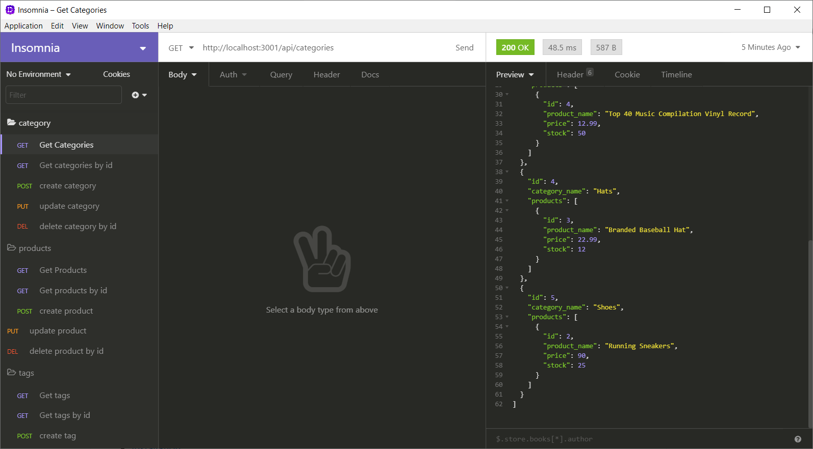

# E-Commerce-BackEnd

## Description

A back end e-commerce API made with Express.js and Sequelize ORM

## Table of Contents
  * [Installation](#installation)
  * [Usage](#usage)
  * [License](#license)
  * [Contributing](#contributing)
  * [Testing](#testing)
  * [Questions](#questions)

## Installation
  Clone project, navigate to the directory and run npm install

## Usage
Create a .env file in the root of the directory and add the enviromental variables to the form:

    DB_NAME='<your_database_name>' 
    DB_USER='<your_user_name>' 
    DB_PW='<your_mysql_password>' 

Open the MySQL shell with mysql -u root -p and enter your password.
in the shell run source db/schema.sql to create the database
while still in the shell, run show database to confirm the database creation.
run quit; to return to the command line.
Use npm run seed to see the database with sample data.
Use npm start to start the server.

[video](https://drive.google.com/file/d/1lRrPIYj0HOw6Hq5I6c35NnYVipoZ2tEF/view)

## License 
  This project is covered under the MIT license.

## Contributing
  To contribute, contact me with the information provided below.

## Testing
  Tests coming soon.

## Questions
  Visit me at GitHub  
  [ZachWagner1](https://github.com/ZachWagner1)

  Comments or questions? Email me at:
  [zwag14@yahoo.com](mailto:zwag14@yahoo.com)